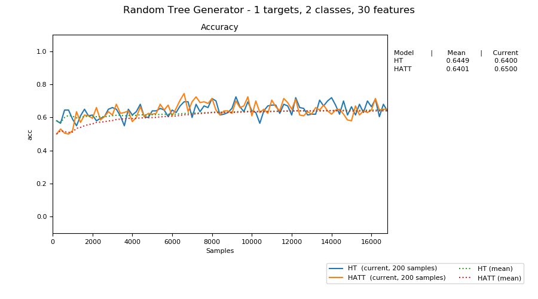

# xtree

Python implemention of the Hoeffding AnyTime Tree algorithm.

Hoeffding AnyTime Tree makes a simple change to the current de facto standard for incremental tree learning. The current stateof-the-art Hoeffding Tree aims to only split at a node when it has identified the best possible split and then to never revisit that decision. In contrast HATT aims to split as soon as a useful split is identified, and then to replace that split as soon as a better alternative is identified.

[[paper]](https://arxiv.org/pdf/1802.08780.pdf) - [[scikit-multiflow]](https://github.com/scikit-multiflow/scikit-multiflow/blob/master/src/skmultiflow/trees/hoeffding_tree.py)

